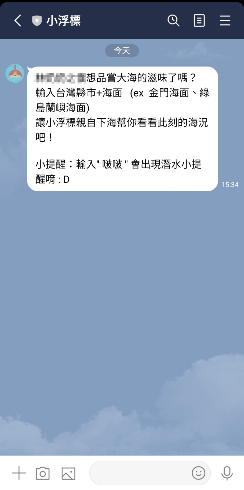
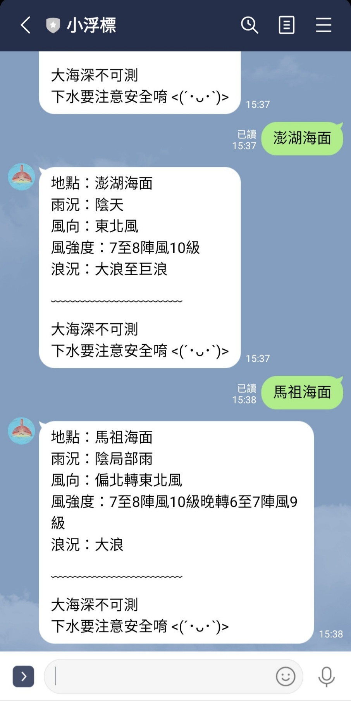
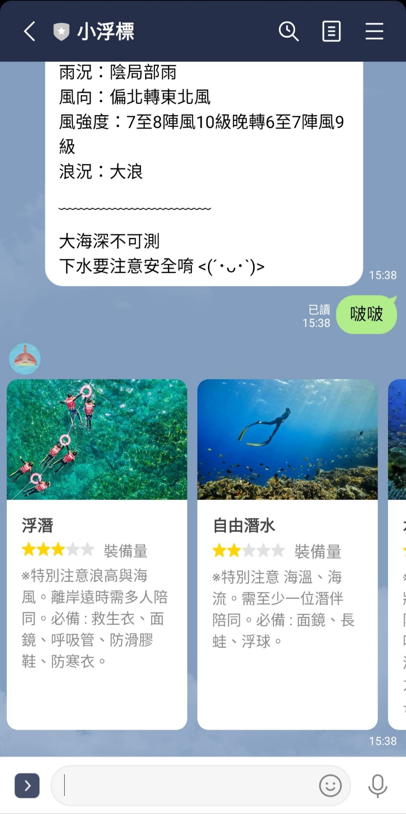

期中作業

## 更新

--交通部氣象局之即時海況 API 永久停用，故暫用此 API，觀測時間為 6h/次。

之前接觸潛水，發現海象變化快速，難以預測， 下水前若是沒有萬全準備，很容易發生意外。

因此選擇製作~~即時~~提供海象的聊天機器人， 內有四個重要判斷依據（風向、雨況、風強度、浪況） 參考資訊為中央部氣象局提供的熱門潛水地點，給所有喜歡自由潛水的海人參考。

Channel ID：@163vnokf

## 作業連結

- [儲存庫](https://github.com/Errol03/line-text)

Channel ID：@163vnokf

## 使用說明示意圖

